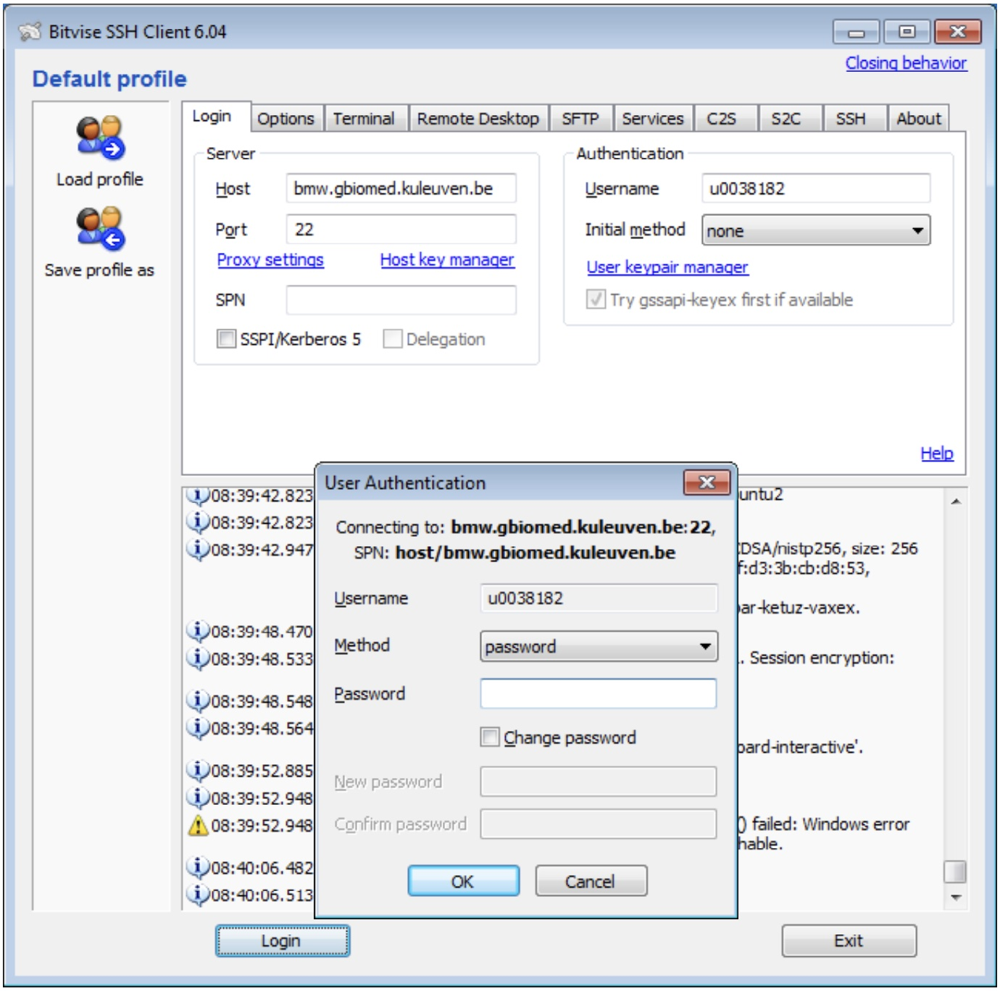
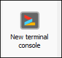
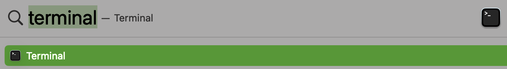
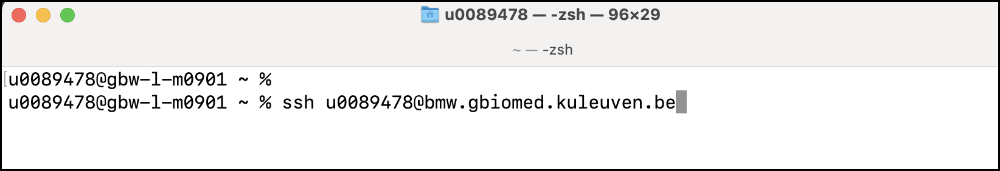
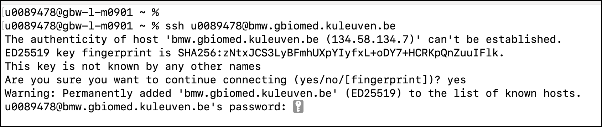

## Getting Access

This document is aimed at students of biomedical sciences at the University of Leuven to become acquainted with the BMW teaching server.

### Required software

To get access you will need the following software installed:

|                    | Windows           | MacOS / Linux     |
| ------------------ | ----------------- | ----------------- |
| SSH Client         | Bitvise           | Terminal          |
| Web Browser        | Firefox or Chrome | Firefox or Chrome |
| File transfer [^1] | Bitvise           | Cyberduck         |

[^1]: Optional - it is also possible to use the Jupyter file browser

### The BMW teaching server

We will be working on a server hosted at the department of biomedical sciences - specifically for teaching purposes. This is the information you need to connect:

**Hostname**: bmw.gbiomed.kuleuven.be

**Username**: Your r-number or s-number

**Jupyter server**: [https://jupyter.gbiomed.kuleuven.be/](https://jupyter.gbiomed.kuleuven.be/)

To get access to Jupyter you will first need to log in to the server using SSH.

#### Using Bitvise to get access (Windows)

You can download and install the Bitvise SSH Client from [https://www.bitvise.com/ssh-client](https://www.bitvise.com/ssh-client). 

After installation, you open Bitvise to create a new connection. Make sure you enter the `Host`, `Port` (to 22) and `Username`. 

After that press the `Login` button, after which you get a `User Authentication` dialog where you enter your (KU Leuven intranet) `Password`.

It is possible you first get a dialog asking for `Host Key Verification`, which you can `Accept and Save`.

Once you are logged in, you *must* press the `New Terminal Console` button, which will give you a terminal window.

#### Using a Terminal to get access (Macos)

If you are on a Mac (or Linux), you do not need to install an SSH client, but can use the built in Terminal. To use this open `Terminal` (using Spotlight):

In the terminal window, you enter `ssh <r-number>@bmw.gbiomed.kuleuven.be` (replacing `<r-number>` with your actual r-number)

You may get a prompt asking about the authenticity of the host based on a fingerpint. You can accept this (type `yes`). After which you need to enter your password (note - you will not see the characters that you type).

After that, you should be logged in. You can check this by the prompt in the terminal. That should now state `<r-number>@gbw-s-bmw02`.

